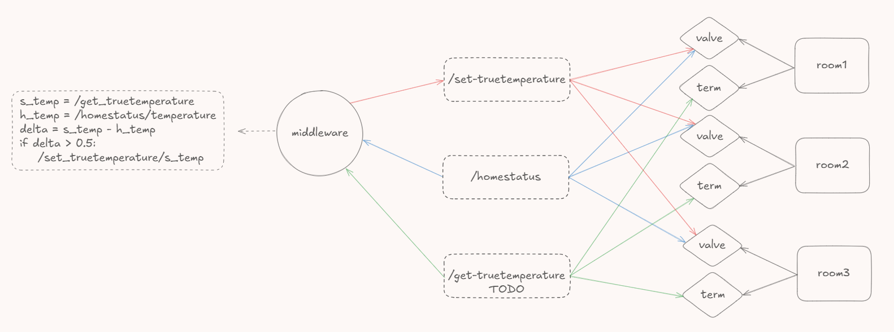

### 📄 \\wsl.localhost\Ubuntu-24.04\home\engineering\netatmo-tt-system\README.md
*Saved at: 12/24/2025, 1:02:44 AM*

**[REMOVED]**
```
(from line ~17)
## Usage Examples

```
**[REMOVED]**
```
(from line ~18)



```

---

